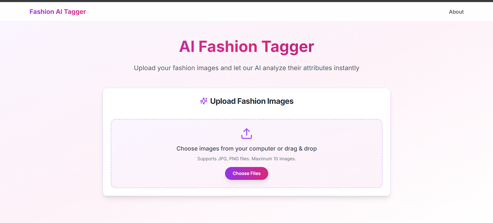
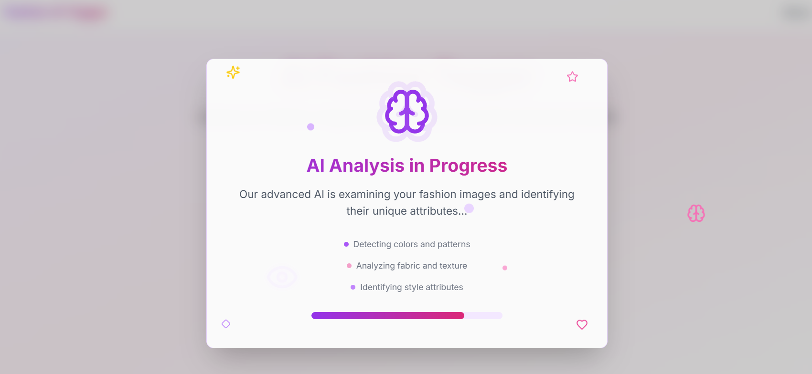

# 👗 AI Fashion Tagger – Meesho Visual Taxonomy

Developed a deep learning model using a modified EfficientNet to predict fashion attributes from product images, achieving a **75% harmonic mean F1-score**. Integrated into a full-stack web application with an intuitive interface for image uploads, instant prediction display, and report generation with PDF/CSV exports for real-time inference.

---

## 🌟 Features

- **Upload Images:** Drag & drop or select product images.
- **AI Attribute Prediction:** Automated analysis of fashion attributes using state-of-the-art deep learning.
- **Instant Results:** Detailed predictions with user-friendly previews.
- **Export Reports:** Download results as PDF or CSV for sharing and record-keeping.

---

## 🖥️ Live Demo

- *Deployed link:** [Demo Link Coming Soon](https://fashion-ai-tagger-meesho-1.onrender.com)
- **Backend API:** Request at Conatct Point.

---

## 🚀 Quick Start

### Backend
```bash
cd backend
pip install -r requirements.txt
uvicorn main:app --reload
```

### Frontend
```bash
cd Frontend/meesho-version-re2
npm install
npm run dev
```

---

## ⚡ Deployment

- **Backend:** Python, FastAPI, EfficientNet
- **Frontend:** React.js, Tailwind CSS
- **Platform:** Render.com

---

## 🛠 Tech Stack

- **Backend:** Python, FastAPI, EfficientNet (modified), Flask
- **Frontend:** React.js, Tailwind CSS
- **Deep Learning:** PyTorch/TensorFlow
- **Reporting:** PDF/CSV generation
- **Deployment:** Render.com

---

## 📂 Project Structure

```plaintext
├── backend/
│   ├── main.py
│   ├── model/
│   └── requirements.txt
├── Frontend/
│   └── meesho-version-re2/
│       ├── src/
│       └── package.json
├── notebooks/
│   └── model_training.ipynb
└── README.md
```

---

## 📸 Screenshots

Below are sample screenshots of the AI Fashion Tagger application:

<p align="center">
  
  <br>
  <em>Home Page</em>
</p>

<p align="center">
  
  <br>
  <em>Image Upload Interface</em>
</p>

<p align="center">
  
  <br>
  <em>Prediction Results Display</em>
</p>

<p align="center">
  
  <br>
  <em>Report Export Feature</em>
</p>


## 🙌 Acknowledgements

Special thanks to Meesho for providing the dataset and resources.

---

**Made with ❤️ by Team TechTrio**
